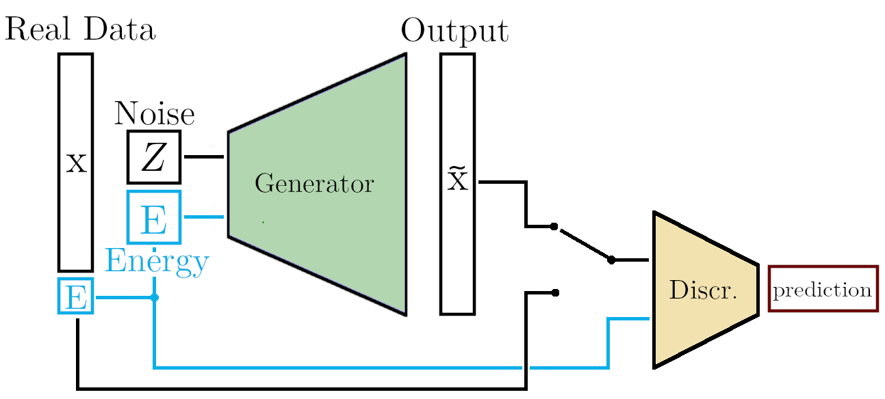
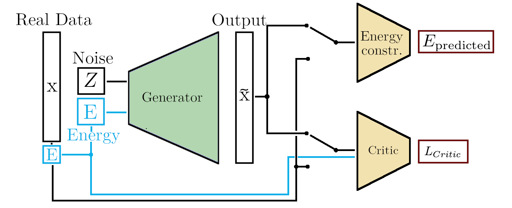
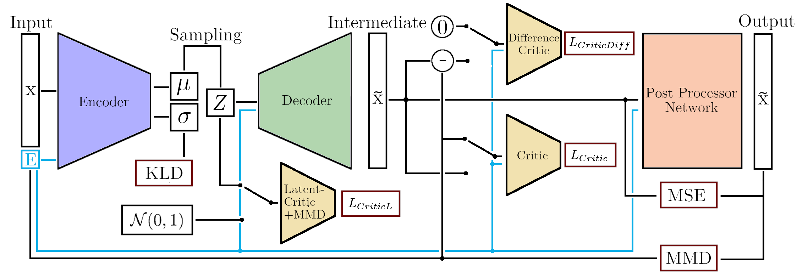

# Generative Models for High-granularity Calorimeter of ILD
We are modelling electromagnetic showers in the central region of the Silicon-Tungsten calorimeter of the proposed ILD. We investigate the use of a new architecture: Bounded-Information Bottleneck Autoencoder. In addition, we are utilising WGAN-GP and vanilla GAN approaches. In total, we train 3 generative models. 

This repository contains ingredients for repoducing *Getting High: High Fidelity Simulation of High Granularity Calorimeters with High Speed* [[`arXiv:2005.05334`](https://arxiv.org/abs/2005.05334)]

## Data Generation and Preparation 

#### Step 1: ddsim + Geant4
We use [[`iLCsoft`](https://github.com/iLCSoft)] ecosystem which includes `ddsim` and `Geant4`. It is better to use generation code that outputs big files to a scratch space. For DESY and NAF users: you may want to use DUST strogage in **CentOS7** NAF-WGs.

First we need to pull `ILDConfig` repository and go to its specific folder.

```
git clone --branch v02-01-pre02 https://github.com/iLCSoft/ILDConfig.git
cd ILDConfig/StandardConfig/production
```
copy all `.py`, `.sh` and `create_root_tree.xml` files to this folder from `training_data` folder. 


We use `singularity` (with `docker` image) to generate Geant4 showers. Please export necessary singularity **tmp** and **cache** for convenience. 

```bash
export SINGULARITY_TMPDIR=/nfs/dust/ilc/user/eren/container/tmp/
export SINGULARITY_CACHEDIR=/nfs/dust/ilc/user/eren/container/cache/

```
Please change it for **your** scratch space. Now we can start the instance and run it

```bash
singularity instance start -H $PWD --bind $(pwd):/home/ilc/data docker://ilcsoft/ilcsoft-centos7-gcc8.2:v02-01-pre instance1
singularity run instance://instance1 ./generateG4-gun.sh instance1

```

This generates **1000 showers**. Play with `gammaGun.mac` if you want to change it.

#### Step 2: Marlin framework to create root files
Now we would like to use `Marlin` framework in `iLCsoft`. `Marlin` takes `lcio` file, which was created in the previous step and creates `root` file

```bash
## copy create_root_tree.xml and marlin.sh file 
singularity run instance://instance1 ./marlin.sh "photon-shower-instance1.slcio"

```

#### Step 3: Conversion to hdf5 files
It is handy to use `uproot` framework to stream showers from `root` file in order to create `hdf5` file, which is really important for our neutral network achiterctures. 

```bash
singularity run -H $PWD docker://engineren/pytorch:latest python create_hdf5.py --ncpu 8 --rootfile testNonUniform.root --branch photonSIM --batchsize 100

```

#### Step 4: Remove staggering effects 
Our simulation of ILD calorimeter is a realistic one. That's why we have irregularities in geometry. This causes staggering in `x` direction; we see artifacts (i.e empty lines due to binning). In order to mitigate this effect, we apply a correction and thus remove artifacts.

```bash
singularity run -H $PWD docker://engineren/pytorch:latest python corrections.py --input test_30x32.hdf5 --output showers-1k.hdf5 --batchsize 100 --minibatch 10
```

choose batchsize and mini-batch size such a way that `total showers = batchsize  * minibatch` (i.e 1000 = 100 * 10 )

#### Structure of HDF5 file

Created file `showers-1k.hdf5` has the following structure: 
* Group named `30x30`
     * `energy`               : Dataset {1000, 1}
     * `layers`               : Dataset {1000, 30,30,30}

As stated in our paper, we have trained our model on 950k showers, which is approximately 200 Gb. That is why we are able to put only a small fraction of our training data to [[`Zenado`](https://zenodo.org/record/3826103#.Xrz1RBZS-EI)]
 
## Architectures

The network architectures of generative models have a large number of moving parts and the contributions from various generators, discriminators, and critics need to be carefully orchestrated to achieve good results. Due to the high computational cost of the studies, no systematic tuning of hyperparameters was performed.

### GAN

Our implementation of the `vanilla` GAN is a baseline model consisting of a generator and a discriminator. The generator network of the GAN consists of 3-dimensional transposed convolution layers with batch normalization. It takes a noise vector of length 100, uniformly distributed from -1 to 1, and the true energy labels E as inputs. The discriminator uses five 3-dimensional convolution layers followed by two fully connected layers with 257 and 128 nodes respectively. We flatten the output of the convolutions and concatenate it the with input energy before passing it to the fully connected layers. Each fully connected layer except the final one uses LeakyReLU (slope: −0.2) as an activation function. The activation in the final layer is sigmoid. In total, the generator has 1.5M trainable weights and the discriminator has 2.0M weights. 

### WGAN

One alternative to classical GAN training is to use the Wasserstein-1 distance, also known as earth mover's distance, as a loss function. The WGAN architecture consists of 3 networks: 

* one generator with 3.7M weights, 
* one critic with 250k weights, 
* one constrainer network with 220k weights.

The critic network starts with four 3D convolution layers with kernel sizes (X,2,2) with `X=10,6,4,4` which have 32, 64, 128, and 1 filters respectively. LayerNorm layers are sandwiched between the convolutions. After the last convolution, the output is concatenated with the `E` vector required for $E-$conditioning. After that, it is flattened and fed into a fully connected network with 91, 100, 200, 100, 75, 1 nodes. Throughout the critic, LeakyReLU (slope: -0.2) is used as activation function.

The generator network takes a latent vector `z` (normally distributed with length 100) and true `E` labels as input and separately passes them through a 3D transposed convolution layer using a `4x4x4` kernels with 128 filters. After that, the outputs are concatenated and processed through a series of four 3D transposed convolution layers (kernel size `4x4x4` with filters of 256, 128, 64, 32).  LayerNorm layers along with ReLU activation functions are used throughout the generator.

The energy-constrainer network is similar to the critic: three 3D convolutions with kernel sizes `3x3x3`, `3x3x3` and `2x2x2` along with 16, 32, and 16 filters are used. The output is then fed into a fully connected network with 2000, 100, and 1 nodes. LayerNorm layers and LeakyReLU (slope: -0.2) are sandwiched in between convolutional layers.


### BIB-AE and Post Processing

An instructive way for describing the base BIB-AE framework is by taking a VAE and expanding upon it. A default VAE consist of four general components: 

*  encoder, 
*  decoder, 
*  latent-space regularized by the Kullback--Leibler divergence (KLD), 
*  an L<sub>N</sub>-norm to determine the difference between the original and the reconstructed data. 

These components are all present as well in the BIB-AE setup. Additionally, one introduces a GAN-like adversarial network, trained to distinguish between real and reconstructed data, as well as a sampling based method of regularizing the latent space, such as another adversarial network or a maximum mean discrepancy (MMD, as described in the next section) term. In total this adds up to four loss terms: The KLD on the latent space, the sampling regularization on the latent space, the L<sub>N</sub> norm on the reconstructed samples and the adversary on the reconstructed samples. The guiding principle behind this is that the two latent space and the two reconstruction losses complement each other and, in combination, allow the network to learn a more detailed description of the data.

Please refer to our paper *Appendix A.3* a more detailed description of BiB-AE and Post Processing network architectures. 


## Training

In order to train our generative models, please make sure you downloaded `hdf5` file from Zenado and put it into `training_data` folder. Alternatively, you can contact authors and ask for more data or you could generate yourself by following instructions above. 

### Bib-AE

1. Choose BIBAE_Run for BIBAE training or BIBAE_PP_Run for BIBAE with post processing training
2. Modify parameters accoring to your need
3. launch python BIBAE_Run.py or python BIBAE_PP_Run.py 

It is convinient to export singularity `cache` and `tmp` directory before running. 

```bash
export SINGULARITY_TMPDIR=/path/to/your/container/tmp
export SINGULARITY_CACHEDIR=/path/to/your/container/cache/
```
then run the training with the docker image, which contains all the dependencies required for the training. 

```bash
git clone https://github.com/FLC-QU-hep/getting_high.git
cd getting_high
singularity run --nv docker://engineren/pytorch:latest python BIBAE/BIBAE_Run.py

```
### WGAN

#### Option 1: Running on a single GPU

This is option for training WGAN model exclusively on a single GPU. You might want to adjust `batch_size` in the `main()` function so that data fits into your GPU's memory. Also, please make sure that `output` and `exp` paths exist before you run the training process.  

```bash
## assuming you are still in the getting_high/ directory
singularity run --nv docker://engineren/pytorch:latest python WGAN/wGAN.py

```
#### Option 2: Running on distributed GPUs 

With this option, you are able to run WGAN model across distributed GPUs (i.e GPUs which are in different physical machines) in your cluster. We are using Maxwell cluster at DESY with `slurm` workload manager enabled. 

```bash
#!/bin/bash

#SBATCH --partition=your-partition
#SBATCH --nodes=3                                 # Number of nodes
#SBATCH --time=24:00:00     
#SBATCH --constraint="V100"
#SBATCH --chdir   /path/to/your/directory          # directory must already exist!
#SBATCH --job-name  wGAN
#SBATCH --output    wGAN-%N.out            # File to which STDOUT will be written
#SBATCH --error     wGAN-%N.err            # File to which STDERR will be written
#SBATCH --wait-all-nodes=1
#SBATCH --mail-type END 

## go to the target directory
cd /path/to/your/repo/getting_high

## Setup tmp and cache directory of singularity
export SINGULARITY_TMPDIR=/path/to/your/container/tmp
export SINGULARITY_CACHEDIR=/path/to/your/container/cache/

# make sure you have the same filename inside wGAN_DDP.py
mkdir -p output/WGANv1

## start the containers
srun -N 3 singularity run --nv docker://engineren/pytorch:latest python WGAN/wGAN_DDP.py


```
